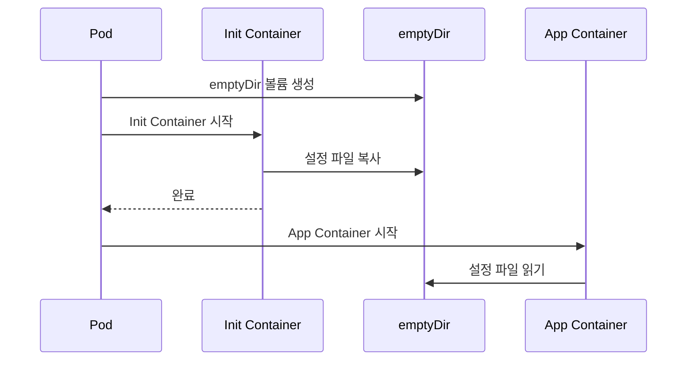

# Immutable Configuration Pattern - 테스트 가이드

## 개요

Immutable Configuration 패턴은 애플리케이션 설정을 불변(immutable) 상태로 관리하여 항상 예측 가능하고 기록된 상태를 유지하는 방법입니다. 이 디렉토리는 Init Container를 활용한 Immutable Configuration 패턴의 구현과 테스트를 포함합니다.

## 디렉토리 구조

```
ImmutableConfiguration/
├── config-src/          # 설정 파일 소스
│   ├── dev/            # 개발 환경 설정
│   │   ├── app.properties
│   │   └── database.yaml
│   └── prod/           # 운영 환경 설정
│       ├── app.properties
│       └── database.yaml
├── manifests/          # Kubernetes 매니페스트
│   ├── 01-basic-deployment.yaml
│   ├── 02-init-failure-test.yaml
│   ├── 03-permission-test.yaml
│   ├── 04-configmap-comparison.yaml
│   └── 05-multi-file-deployment.yaml
├── tests/              # 테스트 스크립트
│   ├── common.sh
│   ├── test1-basic.sh
│   ├── test2-multi-file.sh
│   ├── test3-init-failure.sh
│   ├── test4-configmap-comparison.sh
│   ├── test5-rollback.sh
│   └── run-all-tests.sh
├── Dockerfile.config   # 설정 이미지 빌드용 Dockerfile
└── README.md          # 이 문서
```

## 사전 요구사항

### 필수 도구

- Docker
- Minikube
- kubectl

### Minikube 시작

```bash
# Minikube 시작
minikube start

# Minikube 상태 확인
minikube status

# Minikube Docker 환경 설정 (이미지 빌드용)
eval $(minikube docker-env)
```

## 패턴 설명

### Init Container 방식

Init Container를 사용하여 설정 데이터를 컨테이너 이미지로 패키징하고, Pod 시작 시 emptyDir 볼륨에 복사합니다.



### 주요 특징

1. **버전 관리**: 설정을 컨테이너 이미지로 관리하여 버전 관리 가능
2. **불변성**: 컨테이너 이미지는 불변이므로 설정 변경 시 새 버전 생성 필요
3. **크기 제한 없음**: ConfigMap의 1MB 제한 없이 대용량 설정 가능
4. **환경 분리**: 환경별(dev/prod) 설정을 별도 이미지로 관리

## 테스트 수행

### 1. 전체 테스트 실행

모든 테스트를 순차적으로 실행합니다.

```bash
cd tests
chmod +x *.sh
./run-all-tests.sh
```

### 2. 개별 테스트 실행

#### Test 1: 기본 Init Container 설정 테스트

기본적인 Init Container 패턴이 올바르게 동작하는지 확인합니다.

```bash
./test1-basic.sh
```

**검증 항목:**
- Init Container가 설정 파일을 emptyDir로 복사
- Application Container가 설정 파일을 읽을 수 있음
- 개발 환경 설정이 올바르게 로드됨

#### Test 2: 다중 설정 파일 관리 테스트

여러 설정 파일을 관리하는 시나리오를 테스트합니다.

```bash
./test2-multi-file.sh
```

**검증 항목:**
- 여러 설정 파일(app.properties, database.yaml)이 모두 복사됨
- 각 파일의 내용이 올바르게 로드됨
- 파일 구조가 유지됨

#### Test 3: Init Container 실패 시나리오 테스트

Init Container가 실패할 때 Pod의 동작을 확인합니다.

```bash
./test3-init-failure.sh
```

**검증 항목:**
- Init Container 실패 시 Application Container가 시작되지 않음
- Pod 상태가 적절히 표시됨 (Init:Error, Init:CrashLoopBackOff)
- Kubernetes가 자동으로 재시도함

#### Test 4: ConfigMap 비교 테스트

Immutable ConfigMap 방식과 Init Container 방식을 비교합니다.

```bash
./test4-configmap-comparison.sh
```

**검증 항목:**
- 두 방식 모두 올바르게 동작함
- 시작 시간 차이 측정
- ConfigMap의 불변성 확인
- 각 방식의 장단점 비교

#### Test 5: 설정 버전 롤백 테스트

설정 이미지를 변경하고 롤백하는 시나리오를 테스트합니다.

```bash
./test5-rollback.sh
```

**검증 항목:**
- 개발 환경 설정으로 시작
- 운영 환경 설정으로 업데이트
- 개발 환경 설정으로 롤백
- 각 단계에서 올바른 설정이 로드됨

## 수동 테스트

### 설정 이미지 빌드

```bash
# Minikube Docker 환경 사용
eval $(minikube docker-env)

# 개발 환경 이미지 빌드
docker build -t k8spatterns/immutable-config-dev:1.0 \
  --build-arg ENV=dev \
  -f Dockerfile.config .

# 운영 환경 이미지 빌드
docker build -t k8spatterns/immutable-config-prod:1.0 \
  --build-arg ENV=prod \
  -f Dockerfile.config .

# 이미지 확인
docker images | grep immutable-config
```

### 기본 배포

```bash
# 개발 환경 배포
kubectl apply -f manifests/01-basic-deployment.yaml

# Pod 상태 확인
kubectl get pods -l app=immutable-config-demo

# Pod 로그 확인
POD_NAME=$(kubectl get pods -l app=immutable-config-demo -o jsonpath='{.items[0].metadata.name}')
kubectl logs $POD_NAME

# Init Container 로그 확인
kubectl logs $POD_NAME -c config-init

# 설정 파일 확인
kubectl exec $POD_NAME -- cat /app/config/app.properties
kubectl exec $POD_NAME -- cat /app/config/database.yaml
```

### 설정 변경 및 롤백

```bash
# 운영 환경 설정으로 변경
kubectl set image deployment/immutable-config-app \
  config-init=k8spatterns/immutable-config-prod:1.0

# 롤아웃 상태 확인
kubectl rollout status deployment/immutable-config-app

# 새 Pod 확인
kubectl get pods -l app=immutable-config-demo

# 롤백
kubectl rollout undo deployment/immutable-config-app

# 롤아웃 히스토리 확인
kubectl rollout history deployment/immutable-config-app
```

### 정리

```bash
# 모든 리소스 삭제
kubectl delete deployment immutable-config-app
kubectl delete deployment multi-file-config-app
kubectl delete pod --all
kubectl delete configmap app-config-immutable
```

## 테스트 결과 확인

각 테스트는 다음과 같은 형식으로 결과를 출력합니다:

```
========================================
Test Summary
========================================
Passed: 5
Failed: 0
Total: 5

[SUCCESS] All tests passed! ✓
```

## 장단점 분석

### 장점

1. **버전 관리**: Git과 컨테이너 레지스트리를 통한 설정 버전 관리
2. **크기 제한 없음**: ConfigMap의 1MB 제한 없음
3. **환경 분리**: 환경별 설정을 명확히 분리
4. **롤백 용이**: Kubernetes Deployment 롤백 기능 활용
5. **감사 추적**: 설정 변경 이력 추적 가능

### 단점

1. **복잡성 증가**: 추가 이미지 빌드 및 관리 필요
2. **시작 시간**: Init Container 실행으로 인한 약간의 오버헤드
3. **보안**: 민감 정보는 별도 Secret 관리 필요
4. **스토리지**: 각 Pod마다 설정 파일 복사로 인한 스토리지 사용

## 언제 사용하는가?

- **대용량 설정**: ConfigMap 1MB 제한을 초과하는 설정
- **복잡한 구조**: 다수의 설정 파일이 필요한 경우
- **엄격한 버전 관리**: 설정 변경 이력을 철저히 관리해야 하는 경우
- **환경별 분리**: 개발/스테이징/운영 환경 설정을 명확히 구분해야 하는 경우

## 언제 사용하지 않는가?

- **단순한 설정**: 소수의 키-값 쌍만 필요한 경우 → ConfigMap 사용
- **민감 정보**: 비밀번호, API 키 등 → Secret 또는 외부 시크릿 관리 도구 사용
- **빈번한 변경**: 설정이 자주 변경되는 경우 → ConfigMap 또는 외부 설정 서버 사용
- **동적 설정**: 런타임에 설정이 변경되어야 하는 경우 → 외부 설정 서버 사용

## 참고 자료

- [Kubernetes Patterns 책](https://www.redhat.com/en/resources/oreilly-kubernetes-patterns-cloud-native-apps)
- [Kubernetes ConfigMap 문서](https://kubernetes.io/docs/concepts/configuration/configmap/)
- [Kubernetes Init Containers 문서](https://kubernetes.io/docs/concepts/workloads/pods/init-containers/)
- [k8spatterns 예제 코드](https://github.com/k8spatterns/examples/tree/main/configuration/ImmutableConfiguration)

## 문제 해결

### Init Container가 실패하는 경우

```bash
# Init Container 상태 확인
kubectl describe pod <pod-name>

# Init Container 로그 확인
kubectl logs <pod-name> -c config-init

# 이벤트 확인
kubectl get events --sort-by='.lastTimestamp'
```

### 설정 파일이 로드되지 않는 경우

```bash
# 볼륨 마운트 확인
kubectl describe pod <pod-name> | grep -A 10 "Mounts:"

# 파일 시스템 확인
kubectl exec <pod-name> -- ls -la /app/config/

# 권한 확인
kubectl exec <pod-name> -- ls -la /app/config/
```

### 이미지를 찾을 수 없는 경우

```bash
# Minikube Docker 환경 확인
eval $(minikube docker-env)

# 이미지 존재 확인
docker images | grep immutable-config

# 필요 시 이미지 재빌드
docker build -t k8spatterns/immutable-config-dev:1.0 \
  --build-arg ENV=dev -f Dockerfile.config .
```
