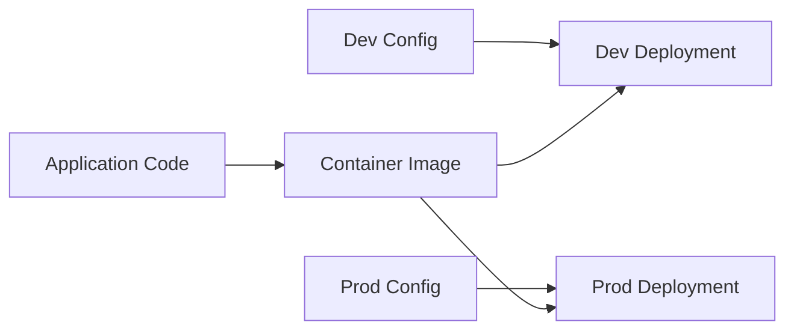
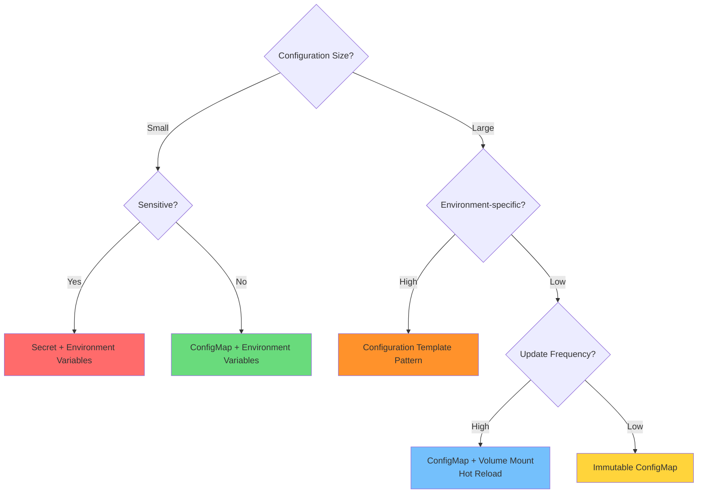

# Configuration Patterns

## Overview

This directory contains implementations and tests for Kubernetes configuration management patterns from the "Kubernetes Patterns" book (Chapters 19-20). These patterns demonstrate various approaches to externalizing application configuration in cloud-native environments.

## Patterns Included

### 1. EnvVar Configuration (Chapter 19)
Environment variable-based configuration using ConfigMaps, Secrets, and Downward API.

**Directory**: `EnvVarConfiguration/`

**Key Features**:
- Direct literal values
- ConfigMap references
- Secret references
- Downward API (Pod metadata)
- Dependent variable expansion
- Bulk import with prefixes

**Best for**: Small, simple configuration values

### 2. Configuration Resource (Chapter 20)
ConfigMap and Secret resources used as environment variables and volume-mounted files.

**Directory**: `ConfigurationResource/`

**Key Features**:
- Individual and bulk environment variable injection
- Volume-mounted configuration files
- Hot reload support (volume mounts only)
- Immutable ConfigMaps (Kubernetes 1.21+)
- File permissions and ownership control

**Best for**: Configuration files, structured data, production deployments

## Directory Structure

```
configuration/
├── EnvVarConfiguration/
│   ├── manifests/              # Kubernetes manifests
│   │   ├── configmap.yaml
│   │   ├── secret.yaml
│   │   ├── pod.yaml
│   │   └── service.yaml
│   ├── tests/                  # Automated tests
│   │   └── test-envvar.sh
│   └── README.md              # Pattern documentation
│
├── ConfigurationResource/
│   ├── manifests/
│   │   ├── configmap.yaml              # Basic ConfigMap
│   │   ├── configmap-mutable.yaml      # Mutable for hot reload
│   │   ├── configmap-immutable.yaml    # Immutable (v1.21+)
│   │   ├── pod.yaml                    # Basic pod
│   │   ├── pod-mutable.yaml            # Hot reload testing
│   │   └── service.yaml
│   ├── tests/
│   │   ├── test-basic.sh              # Basic functionality
│   │   ├── test-hot-reload.sh         # Hot reload behavior
│   │   └── test-immutable.sh          # Immutability testing
│   └── README.md
│
├── TEST_RESULTS.md            # Comprehensive test results
└── README.md                  # This file
```

## Quick Start

### Prerequisites

- Kubernetes cluster (minikube, kind, or cloud provider)
- kubectl configured
- bash shell
- curl (optional, for endpoint testing)

### Start Minikube (if using minikube)

```bash
minikube start
minikube status
```

### Run All Tests

```bash
# Navigate to configuration directory
cd configuration

# EnvVar Configuration
./EnvVarConfiguration/tests/test-envvar.sh

# Configuration Resource - Basic
./ConfigurationResource/tests/test-basic.sh

# Configuration Resource - Hot Reload
./ConfigurationResource/tests/test-hot-reload.sh

# Configuration Resource - Immutable
./ConfigurationResource/tests/test-immutable.sh
```

## Test Results Summary

| Pattern | Test | Status | Duration | Key Findings |
|---------|------|--------|----------|--------------|
| EnvVar Configuration | Basic | ✅ PASS | ~30s | All env var methods work |
| Configuration Resource | Basic | ✅ PASS | ~30s | ConfigMap via env/volume |
| Configuration Resource | Hot Reload | ✅ PASS | ~2m | Volume mounts update, env vars don't |
| Configuration Resource | Immutable | ✅ PASS | ~20s | Immutability enforced |

**Overall**: 4/4 tests passed ✅

See [TEST_RESULTS.md](TEST_RESULTS.md) for detailed results.

## Key Concepts

### Configuration Externalization

Following the [Twelve-Factor App](https://12factor.net/config) methodology, configuration should be separated from code:



**Benefits**:
- Same image across all environments
- No secrets in source code
- Environment-specific configuration
- Runtime configuration changes (with hot reload)

### ConfigMap vs Secret

| Aspect | ConfigMap | Secret |
|--------|-----------|--------|
| **Use Case** | Non-sensitive configuration | Sensitive data |
| **Storage** | Plain text | Base64 encoded |
| **Encryption** | No (unless etcd encrypted) | No (unless etcd encrypted) |
| **RBAC** | Standard permissions | More restrictive |
| **Best Practice** | App settings, feature flags | Passwords, tokens, certificates |

**Important**: Base64 is encoding, not encryption. Enable etcd encryption for true security.

### Environment Variables vs Volume Mounts

| Feature | Environment Variables | Volume Mounts |
|---------|----------------------|---------------|
| **Hot Reload** | ❌ No (requires restart) | ✅ Yes (~60s delay) |
| **Size Limit** | Small values only | Up to 1MB (ConfigMap limit) |
| **Use Case** | Simple key-value configs | Configuration files |
| **Application Support** | Universal | Requires file watching |
| **Update Mechanism** | Pod restart | Kubelet sync |

## Configuration Decision Tree



## Best Practices

### ✅ Development Environment

```yaml
# Use mutable ConfigMaps for rapid iteration
apiVersion: v1
kind: ConfigMap
metadata:
  name: app-config-dev
data:
  LOG_LEVEL: DEBUG
  FEATURE_FLAG_NEW_UI: "true"
# No immutable field - can be updated freely
```

### ✅ Production Environment

```yaml
# Use immutable ConfigMaps with versioning
apiVersion: v1
kind: ConfigMap
metadata:
  name: app-config-prod-v1  # Version in name
  labels:
    version: "1"
    environment: production
data:
  LOG_LEVEL: INFO
  FEATURE_FLAG_NEW_UI: "false"
immutable: true  # Cannot be modified
```

**Update Process**:
1. Create `app-config-prod-v2`
2. Update Deployment to reference v2
3. Perform rolling update
4. Delete `app-config-prod-v1` after verification

### ✅ Secrets Management

```yaml
# Use External Secrets Operator
apiVersion: external-secrets.io/v1beta1
kind: ExternalSecret
metadata:
  name: database-credentials
spec:
  refreshInterval: 1h
  secretStoreRef:
    kind: ClusterSecretStore
    name: aws-secrets-manager
  target:
    name: db-credentials
  data:
  - secretKey: password
    remoteRef:
      key: prod/database/password
```

### ✅ Hot Reload with Reloader

```yaml
apiVersion: apps/v1
kind: Deployment
metadata:
  name: myapp
  annotations:
    # Automatically restart pods when ConfigMap changes
    reloader.stakater.com/auto: "true"
spec:
  template:
    spec:
      containers:
      - name: app
        envFrom:
        - configMapRef:
            name: app-config
```

### ✅ GitOps-Friendly Configuration

```yaml
# kustomization.yaml
apiVersion: kustomize.config.k8s.io/v1beta1
kind: Kustomization

configMapGenerator:
- name: app-config
  files:
  - application.properties
  options:
    disableNameSuffixHash: false  # Adds hash for versioning

# Results in: app-config-abc1234
# Automatic rolling update when config changes
```

## Common Patterns

### Database Connection Configuration

```yaml
apiVersion: v1
kind: ConfigMap
metadata:
  name: db-config
data:
  DB_HOST: "postgres.default.svc.cluster.local"
  DB_PORT: "5432"
  DB_NAME: "myapp"
---
apiVersion: v1
kind: Secret
metadata:
  name: db-credentials
type: Opaque
stringData:
  DB_USER: "postgres"
  DB_PASSWORD: "secretpassword"
---
# In Pod spec
envFrom:
- configMapRef:
    name: db-config
- secretRef:
    name: db-credentials
```

### Application Properties File

```yaml
apiVersion: v1
kind: ConfigMap
metadata:
  name: app-properties
data:
  application.properties: |
    server.port=8080
    management.endpoints.web.exposure.include=health,metrics
    spring.datasource.url=jdbc:postgresql://postgres:5432/myapp
    logging.level.root=INFO
---
# In Pod spec
volumeMounts:
- name: config
  mountPath: /etc/app/application.properties
  subPath: application.properties
volumes:
- name: config
  configMap:
    name: app-properties
```

### Multi-Environment Configuration

```yaml
# base/configmap.yaml
apiVersion: v1
kind: ConfigMap
metadata:
  name: app-config
data:
  APP_NAME: "myapp"
  LOG_FORMAT: "json"

---
# overlays/dev/configmap.yaml
apiVersion: v1
kind: ConfigMap
metadata:
  name: app-config
data:
  LOG_LEVEL: "DEBUG"
  ENVIRONMENT: "development"

---
# overlays/prod/configmap.yaml
apiVersion: v1
kind: ConfigMap
metadata:
  name: app-config
data:
  LOG_LEVEL: "INFO"
  ENVIRONMENT: "production"
immutable: true  # Production configs are immutable
```

## Troubleshooting

### Issue: Environment variables not updating

**Symptom**: ConfigMap updated, but Pod still shows old values

**Cause**: Environment variables are set at Pod creation

**Solution**:
```bash
# Option 1: Restart Pod
kubectl rollout restart deployment/myapp

# Option 2: Use volume mounts instead
# (supports hot reload)
```

### Issue: ConfigMap changes not propagating to files

**Symptom**: Volume-mounted file not updating after ConfigMap change

**Checks**:
```bash
# 1. Verify ConfigMap was updated
kubectl get configmap app-config -o yaml

# 2. Check if ConfigMap is immutable
kubectl get configmap app-config -o jsonpath='{.immutable}'

# 3. Wait for kubelet sync (60-90 seconds)
sleep 90

# 4. Check file content
kubectl exec pod-name -- cat /config/file.yaml
```

### Issue: Permission denied on mounted files

**Symptom**: Application cannot read configuration file

**Solution**:
```yaml
# Set appropriate mode in ConfigMap volume
volumes:
- name: config
  configMap:
    name: app-config
    items:
    - key: config.yaml
      path: config.yaml
      mode: 0644  # or 0400 for read-only
```

### Issue: ConfigMap too large

**Symptom**: Error creating ConfigMap larger than 1MB

**Solution**:
```bash
# Option 1: Split into multiple ConfigMaps
# Option 2: Use Immutable Configuration pattern
#           (config in separate container)
# Option 3: Use external configuration service
```

## Performance Considerations

### ConfigMap Size
- **Limit**: 1MB per ConfigMap
- **Recommendation**: Keep ConfigMaps small (<100KB)
- **Large configs**: Use Immutable Configuration pattern

### Hot Reload Overhead
- **Kubelet sync**: Every 60-90 seconds
- **API server load**: Reduced with immutable ConfigMaps
- **Watch overhead**: Eliminated with immutable: true

### Immutable ConfigMaps Benefits (at scale)
- **API server**: ~30% reduction in watch requests
- **Kubelet**: No periodic sync required
- **etcd**: Reduced watch load

## Security Best Practices

1. **Never store secrets in ConfigMaps**
   ```yaml
   # ❌ Wrong
   kind: ConfigMap
   data:
     password: "admin123"

   # ✅ Correct
   kind: Secret
   stringData:
     password: "admin123"
   ```

2. **Enable RBAC for Secrets**
   ```yaml
   apiVersion: rbac.authorization.k8s.io/v1
   kind: Role
   rules:
   - resources: ["secrets"]
     verbs: ["get"]  # Read-only
   ```

3. **Encrypt etcd**
   ```bash
   # Enable encryption at rest
   kube-apiserver --encryption-provider-config=/etc/kubernetes/encryption-config.yaml
   ```

4. **Use External Secrets**
   - HashiCorp Vault
   - AWS Secrets Manager
   - Azure Key Vault
   - Google Secret Manager

5. **Audit configuration access**
   ```yaml
   # Enable audit logging
   auditPolicy:
     rules:
     - level: Metadata
       resources:
       - group: ""
         resources: ["secrets", "configmaps"]
   ```

## Advanced Topics

### 1. Secrets Store CSI Driver

```yaml
apiVersion: secrets-store.csi.x-k8s.io/v1
kind: SecretProviderClass
metadata:
  name: vault-database
spec:
  provider: vault
  parameters:
    vaultAddress: "http://vault:8200"
    roleName: "database"
```

### 2. Configuration Validation

```yaml
# Use admission webhooks to validate configs
apiVersion: admissionregistration.k8s.io/v1
kind: ValidatingWebhookConfiguration
metadata:
  name: config-validator
webhooks:
- name: validate-configmap.example.com
  rules:
  - operations: ["CREATE", "UPDATE"]
    resources: ["configmaps"]
```

### 3. Configuration as Code

```python
# Python example: Pulumi
import pulumi_kubernetes as k8s

config_map = k8s.core.v1.ConfigMap(
    "app-config",
    metadata=k8s.meta.v1.ObjectMetaArgs(
        name="app-config",
    ),
    data={
        "LOG_LEVEL": "INFO",
        "FEATURE_FLAG": "true",
    },
    immutable=True,
)
```

## Related Patterns

- **Configuration Template** (Chapter 22) - Template-based config generation
- **Immutable Configuration** (Chapter 21) - Config in separate containers
- **Service Discovery** (Chapter 10) - Dynamic service configuration
- **Self Awareness** (Chapter 23) - Pod metadata via Downward API

## Tools and Ecosystem

- **[Kustomize](https://kustomize.io/)** - Configuration management
- **[Helm](https://helm.sh/)** - Package manager with templating
- **[External Secrets Operator](https://external-secrets.io/)** - External secret integration
- **[Reloader](https://github.com/stakater/Reloader)** - Auto-restart on config changes
- **[Sealed Secrets](https://github.com/bitnami-labs/sealed-secrets)** - Encrypted secrets in Git
- **[SOPS](https://github.com/mozilla/sops)** - Secret encryption
- **[Vault](https://www.vaultproject.io/)** - Secret management

## References

- [Kubernetes Patterns Book](https://www.oreilly.com/library/view/kubernetes-patterns/9781492050278/)
- [Kubernetes Documentation - ConfigMap](https://kubernetes.io/docs/concepts/configuration/configmap/)
- [Kubernetes Documentation - Secrets](https://kubernetes.io/docs/concepts/configuration/secret/)
- [Twelve-Factor App - Config](https://12factor.net/config)
- [KEP-1412: Immutable Secrets and ConfigMaps](https://github.com/kubernetes/enhancements/tree/master/keps/sig-storage/1412-immutable-secrets-and-configmaps)

## Contributing

To add new tests or patterns:

1. Create manifests in `<pattern>/manifests/`
2. Add test scripts in `<pattern>/tests/`
3. Update pattern README
4. Run tests and update TEST_RESULTS.md
5. Submit pull request

## License

This project follows the same license as the kubernetes-patterns repository.

---

**Last Updated**: 2025-12-20
**Kubernetes Version Tested**: v1.31+ (minikube)
**Test Status**: ✅ All tests passing
