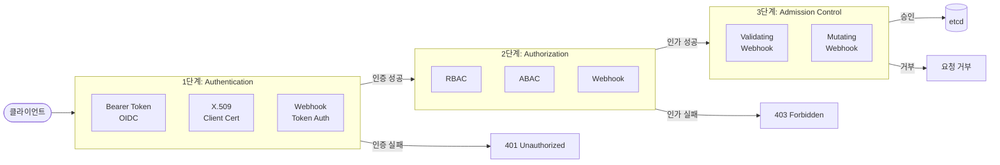
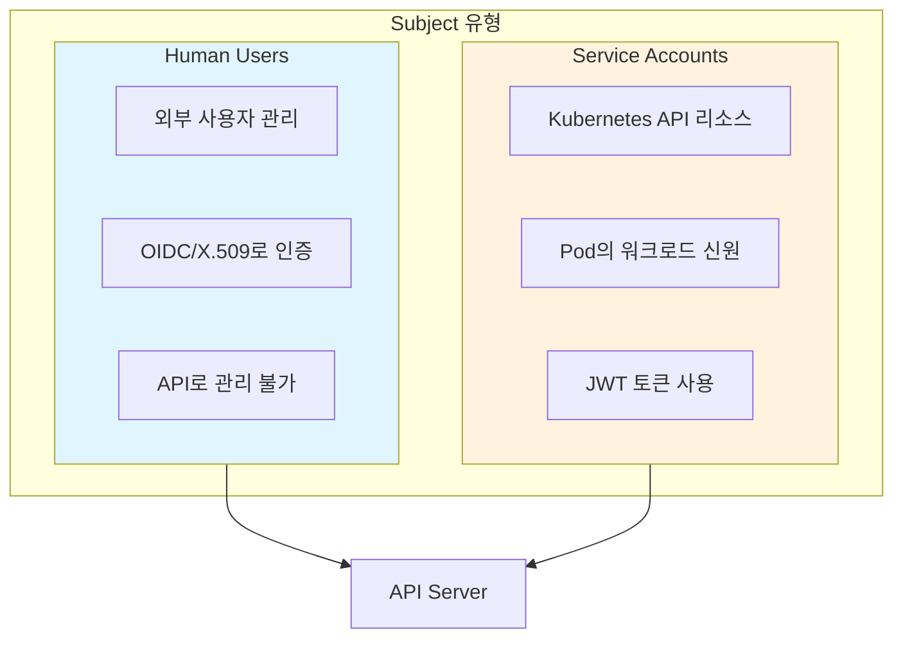
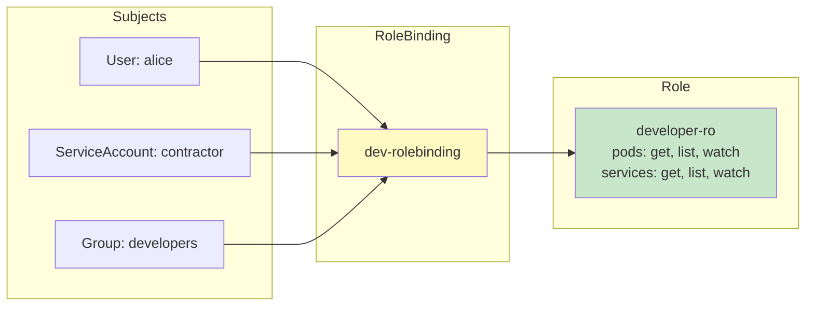
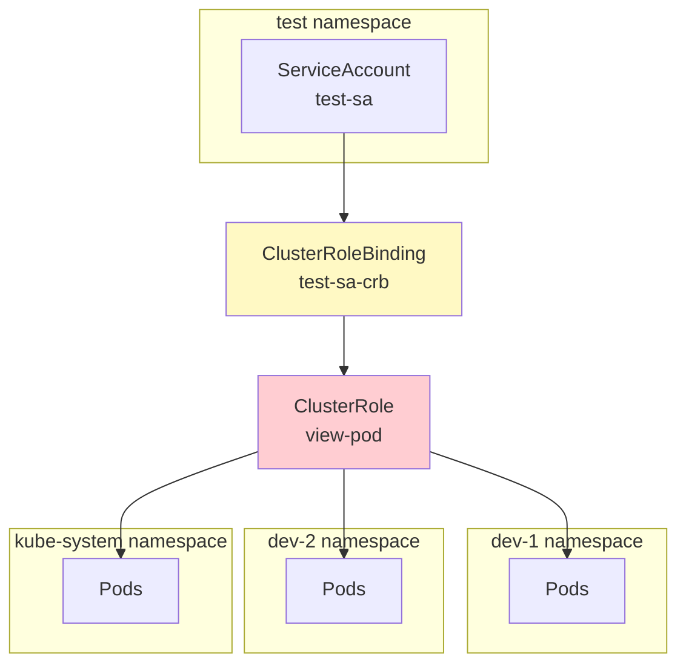
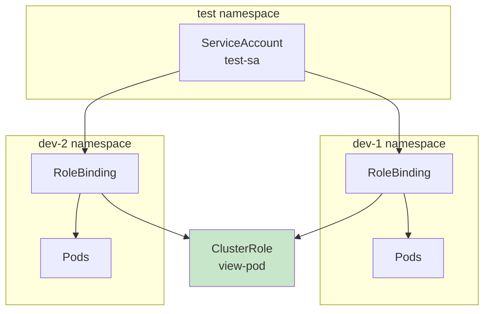
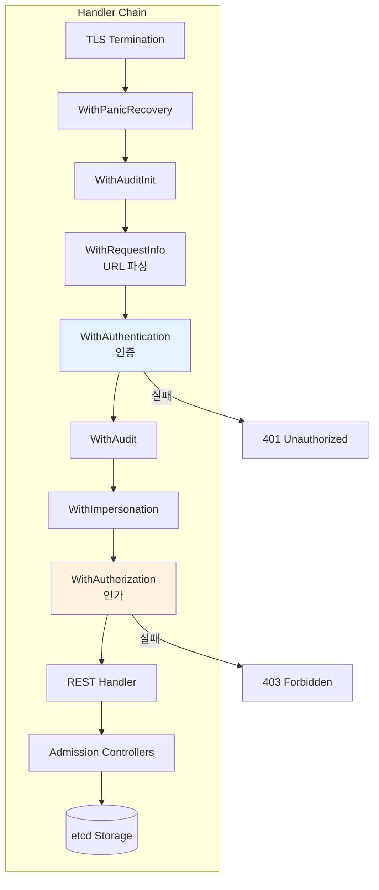
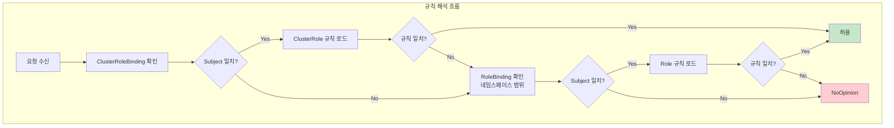
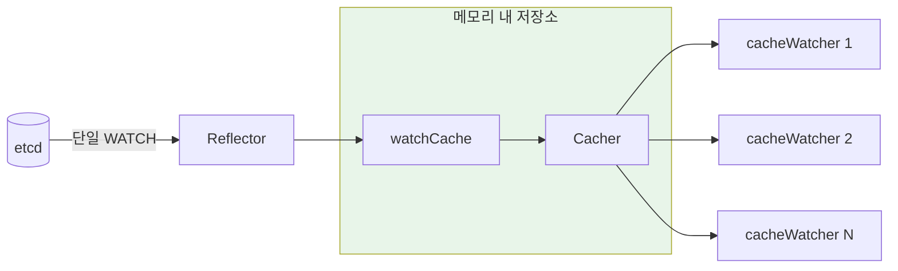
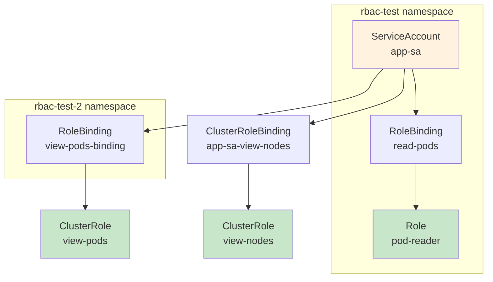

# Kubernetes Access Control 패턴: 인증과 인가

## 개요

2022년 보안 연구에서 약 100만 개의 Kubernetes 인스턴스가 잘못된 설정으로 인해 인터넷에 노출되어 있었다는 조사 결과가 있습니다. 클라우드 인프라와 컨테이너화에 대한 의존도가 높아지면서 Access Control 설정의 중요성이 더욱 커지고 있습니다.

이 글에서는 Kubernetes의 Access Control 패턴을 다룹니다. 기본적인 인증/인가 개념부터 API Server의 내부 구현, etcd 저장 방식, 실제 코드 분석, 그리고 minikube 환경에서의 테스트까지 포함합니다.

## 문제 정의

보안의 핵심에는 두 가지 개념이 있습니다.

**인증(Authentication)**: 요청의 주체가 누구인지 식별하고, 승인되지 않은 행위자의 접근을 방지합니다.

**인가(Authorization)**: 리소스에 대해 어떤 작업이 허용되는지 권한을 결정합니다.

잘못 구성된 접근 제어는 권한 상승과 배포 실패로 이어질 수 있습니다. 높은 권한을 가진 배포는 다른 배포의 설정과 리소스에 접근하거나 수정할 수 있어, 클러스터 전체가 위험에 노출될 수 있습니다.

## Kubernetes의 3단계 보안 체계

Kubernetes API Server로의 모든 요청은 세 단계를 거칩니다.



### 1단계: 인증 (Authentication)

인증은 주로 관리자 영역이지만, 사용 가능한 옵션을 알아두면 유용합니다.

| 인증 방식 | 설명 |
|-----------|------|
| **Bearer Tokens (OIDC)** | OAuth2 제공자를 통한 OpenID Connect 토큰 인증입니다. Authorization 헤더에 토큰을 전송하여 API Server가 검증합니다. |
| **Client Certificates (X.509)** | TLS 인증서를 API Server에 제출하여 검증받습니다. 인증서의 CN(Common Name)이 사용자명, O(Organization)가 그룹으로 매핑됩니다. |
| **Authenticating Proxy** | 사용자 정의 인증 프록시가 클라이언트와 API Server 사이에서 인증을 수행합니다. |
| **Static Token Files** | 파일에 저장된 토큰을 사용하는 방식입니다. |
| **Webhook Token Authentication** | 외부 서비스에 토큰 검증을 위임합니다. |

Kubernetes는 여러 인증 플러그인을 동시에 사용할 수 있습니다. 한 전략이 요청을 인증하면 다른 전략은 확인하지 않습니다. 다만, 평가 순서가 고정되어 있지 않아 어떤 전략이 먼저 확인되는지 알 수 없습니다.

### 2단계: 인가 (Authorization)

Kubernetes는 RBAC을 표준 접근 제어 방식으로 제공합니다. RBAC 외에도 ABAC, Webhook, 사용자 정의 권한 위임 등을 사용할 수 있습니다.

ABAC 방식은 JSON 형식의 정책 파일이 필요하고, 변경 시 서버 재시작이 필요하다는 단점이 있어 거의 사용되지 않습니다. 대부분의 Kubernetes 클러스터는 기본 RBAC 기반 접근 제어를 사용합니다.

### 3단계: Admission Controllers

Admission Controller는 API Server로의 요청을 가로채어 추가 작업을 수행하는 기능입니다. 정책 적용, 유효성 검사, 리소스 수정 등을 수행할 수 있습니다.

외부 웹훅은 전용 리소스로 구성되며, 검증용(ValidatingWebhookConfiguration)과 수정용(MutatingWebhookConfiguration)으로 나뉩니다.

## Subject: 요청의 주체

Subject는 Kubernetes API Server에 대한 요청과 연관된 신원입니다. Kubernetes에는 두 종류의 Subject가 있습니다.



### Users (인간 사용자)

Kubernetes의 인간 사용자는 API에서 명시적 리소스로 정의되지 않습니다. 사용자를 API 호출로 관리할 수 없으며, 인증과 사용자 Subject 매핑은 외부 사용자 관리 시스템에서 수행됩니다.

인증 후 사용자 정보는 다음과 같이 표현됩니다.

```
alice,4bc01e30-406b-4514,"system:authenticated,developers","scopes:openid"
```

이 정보는 다음 부분으로 구성됩니다.
- 사용자명 (alice)
- 고유 사용자 ID (4bc01e30-406b-4514)
- 소속 그룹 목록 (system:authenticated,developers)
- 추가 정보 (scopes:openid)

#### 시스템 예약 사용자명

`system:` 접두사가 붙은 사용자명은 내부 Kubernetes 사용을 위해 예약되어 있습니다.

| 사용자명 | 용도 |
|----------|------|
| system:anonymous | 익명 요청 |
| system:apiserver | API Server 자체 |
| system:kube-proxy | kube-proxy 서비스 |
| system:kube-controller-manager | Controller Manager |
| system:kube-scheduler | Scheduler |

### Service Accounts (서비스 계정)

Service Account는 클러스터 내의 비인간 행위자를 나타내며 워크로드 신원으로 사용됩니다. Pod와 연관되어 컨테이너 내부 프로세스가 API Server와 통신할 수 있게 합니다.

```yaml
apiVersion: v1
kind: ServiceAccount
metadata:
  name: build-bot
  namespace: default
automountServiceAccountToken: false  # 불필요한 토큰 마운트 방지
```

Service Account는 항상 OpenID Connect 핸드셰이크와 JSON Web Token을 사용하여 신원을 증명합니다.

#### Service Account 토큰

Pod가 생성되면 기본적으로 연결된 ServiceAccount의 토큰이 `/var/run/secrets/kubernetes.io/serviceaccount/token`에 마운트됩니다.

```yaml
apiVersion: v1
kind: Pod
metadata:
  name: api-consumer
spec:
  serviceAccountName: build-bot
  containers:
  - name: app
    image: myapp:latest
```

최신 Kubernetes는 **Bound Service Account Token**을 사용합니다. 이 토큰은 시간 제한이 있고, 특정 대상(audience)과 객체에 바인딩되어 보안이 강화됩니다.

### Groups (그룹)

사용자와 Service Account는 하나 이상의 그룹에 속할 수 있습니다. 그룹은 인증 시스템에 의해 요청에 첨부되어 모든 그룹 멤버에게 권한을 부여하는 데 사용됩니다.

| 그룹 | 용도 |
|------|------|
| system:unauthenticated | 모든 인증되지 않은 요청에 할당 |
| system:authenticated | 인증된 사용자에게 할당 |
| system:masters | Kubernetes API Server에 대한 무제한 접근 |
| system:serviceaccounts | 클러스터의 모든 ServiceAccount |
| system:serviceaccounts:\<namespace\> | 해당 네임스페이스의 모든 ServiceAccount |

## Role-Based Access Control (RBAC)

RBAC에서 Role은 Subject가 특정 리소스에 대해 수행할 수 있는 작업을 정의합니다. RoleBinding을 통해 Subject에 Role을 할당합니다.



Subject와 Role 사이에는 다대다 관계가 있습니다. 하나의 Subject가 여러 Role을 가질 수 있고, 하나의 Role이 여러 Subject에 적용될 수 있습니다.

### Role

Role은 Kubernetes 리소스에 대한 허용된 작업을 정의합니다.

```yaml
apiVersion: rbac.authorization.k8s.io/v1
kind: Role
metadata:
  name: developer-ro
  namespace: default
rules:
- apiGroups:
  - ""  # 빈 문자열은 core API 그룹
  resources:
  - pods
  - services
  verbs:
  - get
  - list
  - watch
```

각 규칙은 세 가지 필드로 구성됩니다.

| 필드 | 설명 |
|------|------|
| **apiGroups** | 대상 API 그룹. 빈 문자열("")은 core API 그룹, 와일드카드(*)는 모든 그룹 |
| **resources** | 접근 대상 리소스. 하위 리소스는 "pods/log" 형태로 지정 |
| **verbs** | 허용되는 작업. get, list, watch, create, update, patch, delete, deletecollection 등 |

### RoleBinding

RoleBinding은 Subject와 Role을 연결합니다.

```yaml
apiVersion: rbac.authorization.k8s.io/v1
kind: RoleBinding
metadata:
  name: dev-rolebinding
  namespace: default
subjects:
- kind: User
  name: alice
  apiGroup: rbac.authorization.k8s.io
- kind: ServiceAccount
  name: contractor
  namespace: default
  apiGroup: ""
roleRef:
  kind: Role
  name: developer-ro
  apiGroup: rbac.authorization.k8s.io
```

#### Subject 유형별 설정

| Kind | API Group | Namespace | 설명 |
|------|-----------|-----------|------|
| User | rbac.authorization.k8s.io | N/A | 인간 사용자 참조 |
| Group | rbac.authorization.k8s.io | N/A | 사용자 그룹 참조 |
| ServiceAccount | "" | 선택적 | ServiceAccount 참조, 다른 네임스페이스 지정 가능 |

### ClusterRole

ClusterRole은 클러스터 전체에 적용되는 Role입니다. 두 가지 주요 용도가 있습니다.

1. **클러스터 전체 리소스 보호**: CustomResourceDefinitions, StorageClasses 등 클러스터 수준 리소스에 대한 접근 제어
2. **네임스페이스 간 공유 Role 정의**: 여러 RoleBinding에서 재사용할 수 있는 일반적인 접근 제어 규칙 정의

```yaml
apiVersion: rbac.authorization.k8s.io/v1
kind: ClusterRole
metadata:
  name: view-pod
rules:
- apiGroups:
  - ""
  resources:
  - pods
  verbs:
  - get
  - list
```

#### 기본 제공 ClusterRole

| ClusterRole | 용도 |
|-------------|------|
| view | Secret을 제외한 대부분의 리소스 읽기 허용 |
| edit | Role/RoleBinding을 제외한 대부분의 리소스 읽기/수정 허용 |
| admin | Role/RoleBinding 포함 네임스페이스 내 모든 리소스 완전 제어 |
| cluster-admin | 클러스터 전체 리소스에 대한 완전 제어 |

#### ClusterRole Aggregation

여러 ClusterRole의 권한을 결합할 수 있습니다.

```yaml
apiVersion: rbac.authorization.k8s.io/v1
kind: ClusterRole
metadata:
  name: monitoring
  labels:
    rbac.authorization.k8s.io/aggregate-to-view: "true"
rules:
- apiGroups: [""]
  resources: ["pods/status"]
  verbs: ["get"]
```

### ClusterRoleBinding

ClusterRoleBinding은 ClusterRole을 클러스터 전체에 적용합니다.

```yaml
apiVersion: rbac.authorization.k8s.io/v1
kind: ClusterRoleBinding
metadata:
  name: test-sa-crb
subjects:
- kind: ServiceAccount
  name: test-sa
  namespace: test
roleRef:
  kind: ClusterRole
  name: view-pod
  apiGroup: rbac.authorization.k8s.io
```



ClusterRoleBinding은 모든 네임스페이스에 권한을 부여하므로 주의가 필요합니다. 관리 작업(Nodes, Namespaces, CustomResourceDefinitions 관리 등)에만 사용하는 것이 좋습니다.

### RoleBinding에서 ClusterRole 참조

RoleBinding이 ClusterRole을 참조하면 해당 네임스페이스에만 권한이 적용됩니다.



이 방식은 일반적인 접근 제어 규칙을 정의하고 여러 네임스페이스에서 재사용할 때 유용합니다.

### 권한 상승 방지 (Privilege Escalation Prevention)

RBAC 하위 시스템은 권한 상승을 방지하기 위해 다음 제한을 적용합니다.

- 사용자가 Role을 업데이트하려면 해당 Role의 모든 권한을 이미 가지고 있거나, rbac.authorization.k8s API 그룹의 모든 리소스에 대한 `escalate` verb 권한이 있어야 합니다.
- RoleBinding의 경우, 참조된 Role의 모든 권한을 가지고 있거나 RBAC 리소스에 대한 `bind` verb 권한이 있어야 합니다.

## API Server 내부 동작

API Server가 실제로 어떻게 인증과 인가를 처리하는지 살펴보겠습니다.

### 요청 처리 Handler Chain

모든 API 요청은 `DefaultBuildHandlerChain()`에서 구성된 데코레이터 기반 핸들러 체인을 통과합니다.



핸들러 체인은 fail-fast 방식으로 동작합니다. 인증 실패는 HTTP 401, 인가 거부는 HTTP 403을 반환합니다.

### RequestInfo 구조체

요청 정보는 전체 체인을 통해 전달됩니다.

```go
type RequestInfo struct {
    IsResourceRequest bool
    Verb              string   // get, list, create, update, patch, delete, watch
    APIGroup          string
    APIVersion        string
    Namespace         string
    Resource          string
    Subresource       string
    Name              string
}
```

### 인증 체인 구현

인증 시스템은 두 가지 핵심 인터페이스를 기반으로 합니다.

```go
// Request 인터페이스 - HTTP 요청 인증
type Request interface {
    AuthenticateRequest(req *http.Request) (*Response, bool, error)
}

// Token 인터페이스 - 토큰 인증
type Token interface {
    AuthenticateToken(ctx context.Context, token string) (*Response, bool, error)
}
```

**Union Authenticator**는 여러 인증기를 순차적으로 시도합니다.

```go
func (authHandler *unionAuthRequestHandler) AuthenticateRequest(req *http.Request) (*authenticator.Response, bool, error) {
    for _, currAuthRequestHandler := range authHandler.Handlers {
        resp, ok, err := currAuthRequestHandler.AuthenticateRequest(req)
        if ok {
            return resp, true, nil  // 첫 번째 성공이 최종 결과
        }
    }
    return nil, false, utilerrors.NewAggregate(errlist)
}
```

### Bearer Token 인증 처리

Authorization 헤더에서 토큰을 추출하여 검증합니다.

```go
func (a *Authenticator) AuthenticateRequest(req *http.Request) (*authenticator.Response, bool, error) {
    auth := strings.TrimSpace(req.Header.Get("Authorization"))
    parts := strings.SplitN(auth, " ", 3)
    if len(parts) < 2 || strings.ToLower(parts[0]) != "bearer" {
        return nil, false, nil
    }
    token := parts[1]
    resp, ok, err := a.auth.AuthenticateToken(req.Context(), token)
    if ok {
        req.Header.Del("Authorization")  // 보안: 인증 후 토큰 제거
    }
    return resp, ok, err
}
```

### X.509 인증서 인증 처리

클라이언트 인증서를 검증하고 사용자 정보를 추출합니다.

```go
func (a *Authenticator) AuthenticateRequest(req *http.Request) (*authenticator.Response, bool, error) {
    if req.TLS == nil || len(req.TLS.PeerCertificates) == 0 {
        return nil, false, nil
    }
    opts, ok := a.verifyOptionsFn()  // 동적 CA 재로드 지원
    chains, err := req.TLS.PeerCertificates[0].Verify(opts)
    return a.user.User(chains[0])  // 인증서 체인에서 사용자 추출
}
```

기본 `CommonNameUserConversion`은 인증서의 CN(Common Name)을 사용자명으로, O(Organization) 필드를 그룹으로 매핑합니다. kubeadm이 생성한 admin 인증서가 `O=system:masters`를 사용하는 이유가 바로 이것입니다.

### RBAC 인가 구현

인가 인터페이스는 3가지 결정을 반환합니다.

```go
type Authorizer interface {
    Authorize(ctx context.Context, a Attributes) (Decision, string, error)
}

const (
    DecisionDeny Decision = iota      // 명시적 거부
    DecisionAllow                      // 명시적 허용
    DecisionNoOpinion                  // 일치하는 규칙 없음
)
```

RBAC은 절대로 `DecisionDeny`를 반환하지 않습니다. `DecisionAllow` 또는 `DecisionNoOpinion`만 반환합니다. RBAC은 순수하게 추가적(additive)이기 때문입니다. 규칙은 접근을 허용하며, 일치하는 규칙이 없으면 "의견 없음"을 반환하여 체인의 다른 인가기가 판단할 수 있게 합니다.

### RBAC Authorizer 동작

```go
func (r *RBACAuthorizer) Authorize(ctx context.Context, requestAttributes authorizer.Attributes) (authorizer.Decision, string, error) {
    ruleCheckingVisitor := &authorizingVisitor{requestAttributes: requestAttributes}

    r.authorizationRuleResolver.VisitRulesFor(ctx,
        requestAttributes.GetUser(),
        requestAttributes.GetNamespace(),
        ruleCheckingVisitor.visit)

    if ruleCheckingVisitor.allowed {
        return authorizer.DecisionAllow, ruleCheckingVisitor.reason, nil
    }
    return authorizer.DecisionNoOpinion, reason, nil
}
```

### 규칙 매칭 알고리즘

```go
func RuleAllows(requestAttributes authorizer.Attributes, rule *rbacv1.PolicyRule) bool {
    if requestAttributes.IsResourceRequest() {
        combinedResource := requestAttributes.GetResource()
        if len(requestAttributes.GetSubresource()) > 0 {
            combinedResource = requestAttributes.GetResource() + "/" + requestAttributes.GetSubresource()
        }
        return VerbMatches(rule, requestAttributes.GetVerb()) &&
            APIGroupMatches(rule, requestAttributes.GetAPIGroup()) &&
            ResourceMatches(rule, combinedResource, requestAttributes.GetSubresource()) &&
            ResourceNameMatches(rule, requestAttributes.GetName())
    }
    return VerbMatches(rule, requestAttributes.GetVerb()) &&
        NonResourceURLMatches(rule, requestAttributes.GetPath())
}
```

모든 매처는 `*` 와일드카드를 지원합니다. 빈 `resourceNames` 목록은 "모든 이름과 일치"를 의미합니다.

### DefaultRuleResolver: 바인딩에서 규칙 수집

```go
func (r *DefaultRuleResolver) VisitRulesFor(user user.Info, namespace string, visitor func(...)) {
    // 1. ClusterRoleBinding 확인 (클러스터 전체 권한)
    clusterRoleBindings, _ := r.clusterRoleBindingLister.ListClusterRoleBindings()
    for _, binding := range clusterRoleBindings {
        if appliesTo(user, binding.Subjects, "") {
            rules := r.GetRoleReferenceRules(binding.RoleRef, "")
            for _, rule := range rules {
                if !visitor(source, &rule, nil) { return }
            }
        }
    }

    // 2. 네임스페이스의 RoleBinding 확인
    if len(namespace) > 0 {
        roleBindings, _ := r.roleBindingLister.ListRoleBindings(namespace)
        for _, binding := range roleBindings {
            if appliesTo(user, binding.Subjects, namespace) {
                rules := r.GetRoleReferenceRules(binding.RoleRef, namespace)
                for _, rule := range rules { visitor(source, &rule, nil) }
            }
        }
    }
}
```



## etcd 저장 구조와 캐싱

### RBAC 리소스 저장 구조

RBAC 리소스는 `/registry` 접두사 아래에 계층적 키 구조로 저장됩니다.

| 리소스 유형 | 키 패턴 | 예시 |
|------------|---------|------|
| ClusterRole | `/registry/clusterroles/{name}` | `/registry/clusterroles/cluster-admin` |
| ClusterRoleBinding | `/registry/clusterrolebindings/{name}` | `/registry/clusterrolebindings/system:basic-user` |
| Role | `/registry/roles/{namespace}/{name}` | `/registry/roles/default/pod-reader` |
| RoleBinding | `/registry/rolebindings/{namespace}/{name}` | `/registry/rolebindings/kube-system/system:controller:bootstrap-signer` |

### Cacher 아키텍처

저장 계층은 정교한 캐싱 아키텍처를 구현합니다.



이 아키텍처의 핵심 특징:

- **리소스 타입당 하나의 etcd watch**가 무제한의 API Server 클라이언트를 서비스합니다.
- Indexer를 통한 **메모리 내 조회**로 밀리초 미만의 인가 성능을 제공합니다.
- LIST+WATCH 패턴을 통한 **자동 무효화**가 이루어집니다.

RBAC 인가기는 직접 etcd 쿼리 대신 SharedInformer가 지원하는 **Lister**를 사용합니다.

```go
type RBACAuthorizer struct {
    authorizationRuleResolver RequestToRuleMapper
}

func (l *RoleBindingLister) ListRoleBindings(namespace string) ([]*rbacv1.RoleBinding, error) {
    return l.Lister.RoleBindings(namespace).List(labels.Everything())
}
```

## Bound Service Account Token

최신 Kubernetes는 레거시 시크릿 기반 토큰 대신 **Bound Service Account Token** (KEP-1205)을 사용합니다.

### 토큰 구조

```json
{
  "aud": ["https://kubernetes.default.svc"],
  "exp": 1730727933,
  "iat": 1730720733,
  "iss": "https://kubernetes.default.svc",
  "kubernetes.io": {
    "namespace": "default",
    "pod": {"name": "myapp-6445ccd844-7vs45", "uid": "35275f74-..."},
    "serviceaccount": {"name": "myapp-sa", "uid": "0973e7b0-..."},
    "node": {"name": "node-1", "uid": "2d0b5885-..."}
  },
  "sub": "system:serviceaccount:default:myapp-sa"
}
```

### 토큰 검증 과정

```go
func (v *validator) Validate(ctx context.Context, tokenData string,
    public *jwt.Claims, private *privateClaims) (*ServiceAccountInfo, error) {

    // 1. ServiceAccount 존재 및 UID 일치 확인
    sa, _ := v.getter.GetServiceAccount(namespace, saref.Name)
    if sa.UID != types.UID(saref.UID) { return nil, errors.New("SA UID 불일치") }

    // 2. 바인딩된 Pod 존재 확인 (지정된 경우)
    if podref != nil {
        pod, _ := v.getter.GetPod(namespace, podref.Name)
        if pod.UID != types.UID(podref.UID) { return nil, errors.New("토큰 무효화됨") }
    }

    // 3. 바인딩된 Secret 존재 확인 (지정된 경우)
    // 4. 바인딩된 Node 존재 확인 (지정된 경우)
}
```

**Pod를 삭제하면 해당 프로젝션된 토큰이 즉시 무효화**됩니다. 레거시 토큰 대비 보안이 개선되었습니다.

### Projected Volume을 통한 자동 토큰 갱신

```yaml
spec:
  volumes:
  - name: token
    projected:
      sources:
      - serviceAccountToken:
          path: token
          expirationSeconds: 7200
          audience: vault
```

Kubelet의 토큰 매니저가 다음을 수행합니다.
1. **TokenRequest API**를 통해 토큰 요청
2. 컨테이너 파일시스템에 토큰 작성
3. 수명의 ~80%가 경과하면 **자동 갱신**
4. 기본 만료 시간은 **3607초** (1시간 + 7초)

## RBAC 디버깅

### kubectl auth can-i

특정 권한을 확인할 수 있습니다.

```bash
# 현재 사용자의 권한 확인
kubectl auth can-i list pods --namespace dev-1

# 특정 ServiceAccount의 권한 확인
kubectl auth can-i list pods \
  --namespace dev-1 \
  --as system:serviceaccount:test:test-sa

# 모든 권한 확인
kubectl auth can-i --list --namespace dev-1
```

### SubjectAccessReview API

프로그래밍 방식으로 권한을 확인할 수 있습니다.

```yaml
apiVersion: authorization.k8s.io/v1
kind: SubjectAccessReview
spec:
  resourceAttributes:
    namespace: production
    verb: delete
    resource: pods
  user: jane
  groups:
  - developers
```

응답에서 `status.allowed`가 true/false로, `status.reason`이 "RBAC: allowed by..."로 반환됩니다.

### 유용한 도구

- **rakkess**: `kubectl access-matrix` 명령으로 Subject가 수행할 수 있는 작업의 매트릭스 뷰를 제공합니다.
- **KubiScan**: RBAC 설정에서 위험한 권한을 스캔합니다.

## 실습: RBAC 테스트

### 테스트 환경

minikube 환경에서 RBAC 동작을 검증합니다. 다음 시나리오를 테스트합니다.



### 테스트 리소스 구성

#### 1. Namespace

```yaml
# 01-namespace.yaml
apiVersion: v1
kind: Namespace
metadata:
  name: rbac-test
---
apiVersion: v1
kind: Namespace
metadata:
  name: rbac-test-2
```

#### 2. ServiceAccount

```yaml
# 02-serviceaccount.yaml
apiVersion: v1
kind: ServiceAccount
metadata:
  name: app-sa
  namespace: rbac-test
automountServiceAccountToken: true
---
apiVersion: v1
kind: ServiceAccount
metadata:
  name: no-token-sa
  namespace: rbac-test
automountServiceAccountToken: false  # 토큰 마운트 비활성화
```

#### 3. Role

```yaml
# 03-role.yaml
apiVersion: rbac.authorization.k8s.io/v1
kind: Role
metadata:
  name: pod-reader
  namespace: rbac-test
rules:
- apiGroups: [""]
  resources: ["pods"]
  verbs: ["get", "list", "watch"]
- apiGroups: [""]
  resources: ["pods/log"]
  verbs: ["get"]
```

#### 4. RoleBinding

```yaml
# 04-rolebinding.yaml
apiVersion: rbac.authorization.k8s.io/v1
kind: RoleBinding
metadata:
  name: read-pods
  namespace: rbac-test
subjects:
- kind: ServiceAccount
  name: app-sa
  namespace: rbac-test
roleRef:
  kind: Role
  name: pod-reader
  apiGroup: rbac.authorization.k8s.io
```

#### 5. ClusterRole

```yaml
# 05-clusterrole.yaml
apiVersion: rbac.authorization.k8s.io/v1
kind: ClusterRole
metadata:
  name: view-pods
rules:
- apiGroups: [""]
  resources: ["pods"]
  verbs: ["get", "list", "watch"]
---
apiVersion: rbac.authorization.k8s.io/v1
kind: ClusterRole
metadata:
  name: view-nodes
rules:
- apiGroups: [""]
  resources: ["nodes"]
  verbs: ["get", "list", "watch"]
```

#### 6. ClusterRoleBinding

```yaml
# 06-clusterrolebinding.yaml
apiVersion: rbac.authorization.k8s.io/v1
kind: ClusterRoleBinding
metadata:
  name: app-sa-view-nodes
subjects:
- kind: ServiceAccount
  name: app-sa
  namespace: rbac-test
roleRef:
  kind: ClusterRole
  name: view-nodes
  apiGroup: rbac.authorization.k8s.io
---
# RoleBinding referencing ClusterRole (namespace-scoped)
apiVersion: rbac.authorization.k8s.io/v1
kind: RoleBinding
metadata:
  name: view-pods-binding
  namespace: rbac-test-2
subjects:
- kind: ServiceAccount
  name: app-sa
  namespace: rbac-test
roleRef:
  kind: ClusterRole
  name: view-pods
  apiGroup: rbac.authorization.k8s.io
```

#### 7. Test Pod

```yaml
# 07-test-pods.yaml
apiVersion: v1
kind: Pod
metadata:
  name: api-test
  namespace: rbac-test
spec:
  serviceAccountName: app-sa
  containers:
  - name: curl
    image: curlimages/curl:latest
    command: ["sleep", "3600"]
---
apiVersion: v1
kind: Pod
metadata:
  name: no-token-test
  namespace: rbac-test
spec:
  serviceAccountName: no-token-sa
  containers:
  - name: curl
    image: curlimages/curl:latest
    command: ["sleep", "3600"]
```

### 테스트 결과

minikube 환경에서 13개 테스트를 수행했습니다. 모든 테스트가 통과했습니다.

#### kubectl auth can-i 테스트

| 테스트 | 명령어 | 예상 결과 | 실제 결과 |
|--------|--------|-----------|-----------|
| pods 조회 (rbac-test) | `kubectl auth can-i list pods -n rbac-test --as system:serviceaccount:rbac-test:app-sa` | yes | PASS |
| pods/log 조회 (rbac-test) | `kubectl auth can-i get pods/log -n rbac-test --as system:serviceaccount:rbac-test:app-sa` | yes | PASS |
| pods 삭제 (rbac-test) | `kubectl auth can-i delete pods -n rbac-test --as system:serviceaccount:rbac-test:app-sa` | no | PASS |
| secrets 조회 (rbac-test) | `kubectl auth can-i list secrets -n rbac-test --as system:serviceaccount:rbac-test:app-sa` | no | PASS |
| nodes 조회 (클러스터) | `kubectl auth can-i list nodes --as system:serviceaccount:rbac-test:app-sa` | yes | PASS |
| pods 조회 (rbac-test-2) | `kubectl auth can-i list pods -n rbac-test-2 --as system:serviceaccount:rbac-test:app-sa` | yes | PASS |
| pods 조회 (kube-system) | `kubectl auth can-i list pods -n kube-system --as system:serviceaccount:rbac-test:app-sa` | no | PASS |

#### Pod 내부 API 호출 테스트

Pod 내부에서 ServiceAccount 토큰을 사용하여 API Server에 직접 요청을 보내는 테스트입니다.

```bash
# Pod 내부에서 실행
TOKEN=$(cat /var/run/secrets/kubernetes.io/serviceaccount/token)
CACERT=/var/run/secrets/kubernetes.io/serviceaccount/ca.crt

# pods 조회 (허용)
curl --cacert $CACERT \
  -H "Authorization: Bearer $TOKEN" \
  https://kubernetes.default.svc/api/v1/namespaces/rbac-test/pods
# HTTP 200 반환

# secrets 조회 (거부)
curl --cacert $CACERT \
  -H "Authorization: Bearer $TOKEN" \
  https://kubernetes.default.svc/api/v1/namespaces/rbac-test/secrets
# HTTP 403 반환

# nodes 조회 (허용 - ClusterRoleBinding)
curl --cacert $CACERT \
  -H "Authorization: Bearer $TOKEN" \
  https://kubernetes.default.svc/api/v1/nodes
# HTTP 200 반환
```

| 테스트 | API 경로 | 예상 HTTP 코드 | 실제 결과 |
|--------|----------|----------------|-----------|
| pods 조회 | /api/v1/namespaces/rbac-test/pods | 200 | PASS |
| secrets 조회 | /api/v1/namespaces/rbac-test/secrets | 403 | PASS |
| nodes 조회 | /api/v1/nodes | 200 | PASS |

#### Bound Service Account Token 테스트

```bash
# JWT 토큰 구조 확인 (3개 파트로 구성)
TOKEN=$(cat /var/run/secrets/kubernetes.io/serviceaccount/token)
echo $TOKEN | tr "." "\n" | wc -l  # 3

# 토큰 페이로드에 ServiceAccount 정보 포함 확인
echo $TOKEN | cut -d. -f2 | base64 -d
# "kubernetes.io":{"serviceaccount":{"name":"app-sa"...}} 포함
```

| 테스트 | 확인 내용 | 실제 결과 |
|--------|-----------|-----------|
| JWT 구조 | 토큰이 3개 파트로 구성됨 | PASS |
| SA 정보 | 토큰에 app-sa 포함 | PASS |

#### automountServiceAccountToken 테스트

```bash
# no-token-sa를 사용하는 Pod에서 확인
kubectl exec -n rbac-test no-token-test -- \
  ls /var/run/secrets/kubernetes.io/serviceaccount/token
# 파일 없음 - 토큰이 마운트되지 않음
```

| 테스트 | 확인 내용 | 실제 결과 |
|--------|-----------|-----------|
| 토큰 마운트 비활성화 | automountServiceAccountToken: false 동작 확인 | PASS |

### 테스트 실행 방법

```bash
# 테스트 실행
cd security/AccessControl
./run-tests.sh

# 리소스 정리
./cleanup.sh
```

### 테스트 요약

```
========================================
Test Summary
========================================

Passed: 13
Failed: 0

All tests passed!
```

## RBAC Best Practices

### 와일드카드 권한 피하기

최소 권한 원칙을 따르세요. 와일드카드 권한은 의도치 않은 작업을 허용할 수 있습니다.

```yaml
# 피해야 할 설정
rules:
- apiGroups: ["*"]
  resources: ["*"]
  verbs: ["*"]

# 권장 설정
rules:
- apiGroups: [""]
  resources: ["pods"]
  verbs: ["get", "list"]
```

### cluster-admin ClusterRole 사용 금지

높은 권한의 ServiceAccount는 모든 리소스에 대한 작업을 수행할 수 있어 보안 위협이 됩니다. Pod에 cluster-admin ClusterRole을 할당하지 마세요.

### ServiceAccount 토큰 자동 마운트 비활성화

애플리케이션이 API Server와 통신할 필요가 없다면 토큰 마운트를 비활성화하세요.

```yaml
apiVersion: v1
kind: ServiceAccount
metadata:
  name: my-sa
automountServiceAccountToken: false
```

Pod가 침해되더라도 공격자가 ServiceAccount의 권한으로 API Server와 통신할 수 없습니다.

### RBAC 선택 가이드

| 시나리오 | 사용할 리소스 |
|----------|--------------|
| 특정 네임스페이스의 리소스 보호 | Role + RoleBinding |
| 여러 네임스페이스에서 동일한 접근 규칙 재사용 | ClusterRole + RoleBinding (각 네임스페이스별) |
| 기존 ClusterRole 확장 | ClusterRole + aggregationRule |
| 모든 네임스페이스의 특정 리소스 접근 | ClusterRole + ClusterRoleBinding |
| 클러스터 전체 리소스(CRD 등) 관리 | ClusterRole + ClusterRoleBinding |

## 주요 소스 코드 경로

| 컴포넌트 | 경로 |
|----------|------|
| Authenticator 인터페이스 | `staging/src/k8s.io/apiserver/pkg/authentication/authenticator/interfaces.go` |
| Union Authenticator | `staging/src/k8s.io/apiserver/pkg/authentication/request/union/union.go` |
| Bearer Token 인증 | `staging/src/k8s.io/apiserver/pkg/authentication/request/bearertoken/bearertoken.go` |
| X.509 인증서 인증 | `staging/src/k8s.io/apiserver/pkg/authentication/request/x509/x509.go` |
| OIDC 인증 | `staging/src/k8s.io/apiserver/plugin/pkg/authenticator/token/oidc/oidc.go` |
| Authorizer 인터페이스 | `staging/src/k8s.io/apiserver/pkg/authorization/authorizer/interfaces.go` |
| RBAC Authorizer | `plugin/pkg/auth/authorizer/rbac/rbac.go` |
| Rule Resolver | `pkg/registry/rbac/validation/rule.go` |
| Handler Chain | `staging/src/k8s.io/apiserver/pkg/server/config.go` |
| Cacher | `staging/src/k8s.io/apiserver/pkg/storage/cacher/cacher.go` |
| SA Token Claims | `pkg/serviceaccount/claims.go` |

## 정리

Kubernetes Access Control 패턴의 핵심 설계 원칙:

1. **플러그 가능성**: 잘 정의된 인터페이스(authenticator.Request, authorizer.Authorizer)를 통한 확장성
2. **Fail-Fast 동작**: 핸들러 체인의 조기 종료를 통한 효율적인 요청 처리
3. **성능 최적화**: Informer 기반 캐싱으로 인가 중 etcd 왕복 제거
4. **보안 강화**: Bound Service Account Token으로 시간 제한, 대상 바인딩, 객체 바인딩된 JWT 사용

RBAC을 올바르게 구성하면 권한 상승 경로를 차단하고 클러스터 보안을 강화할 수 있습니다.

## 파일 구조

```
security/AccessControl/
├── README.md                 # 이 문서
├── 01-namespace.yaml         # 테스트 네임스페이스
├── 02-serviceaccount.yaml    # ServiceAccount
├── 03-role.yaml              # Role
├── 04-rolebinding.yaml       # RoleBinding
├── 05-clusterrole.yaml       # ClusterRole
├── 06-clusterrolebinding.yaml # ClusterRoleBinding
├── 07-test-pods.yaml         # 테스트 Pod
├── run-tests.sh              # 테스트 실행 스크립트
└── cleanup.sh                # 리소스 정리 스크립트
```

## 참고 자료

- [Access Control Example](https://github.com/k8spatterns/examples/tree/main/security/AccessControl)
- [Controlling Access to the Kubernetes API](https://kubernetes.io/docs/concepts/security/controlling-access/)
- [RBAC Good Practices](https://kubernetes.io/docs/concepts/security/rbac-good-practices/)
- [Bound Service Account Tokens](https://kubernetes.io/docs/reference/access-authn-authz/service-accounts-admin/#bound-service-account-token-volume)
- [Kubernetes Authentication Strategies](https://kubernetes.io/docs/reference/access-authn-authz/authentication/)
- [Rakkess - kubectl plugin for RBAC](https://github.com/corneliusweig/rakkess)
