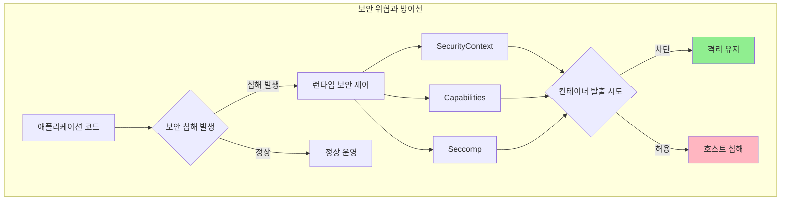
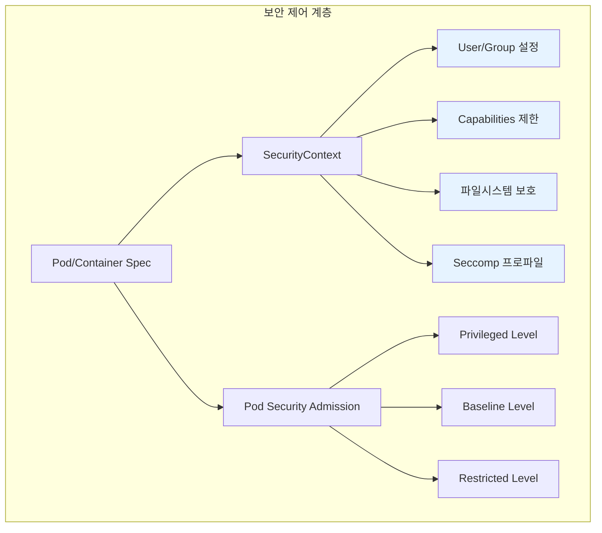
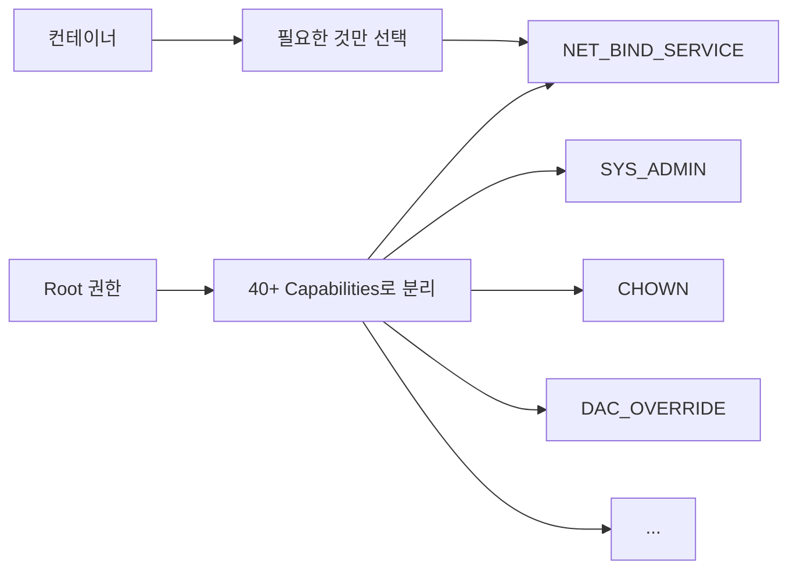
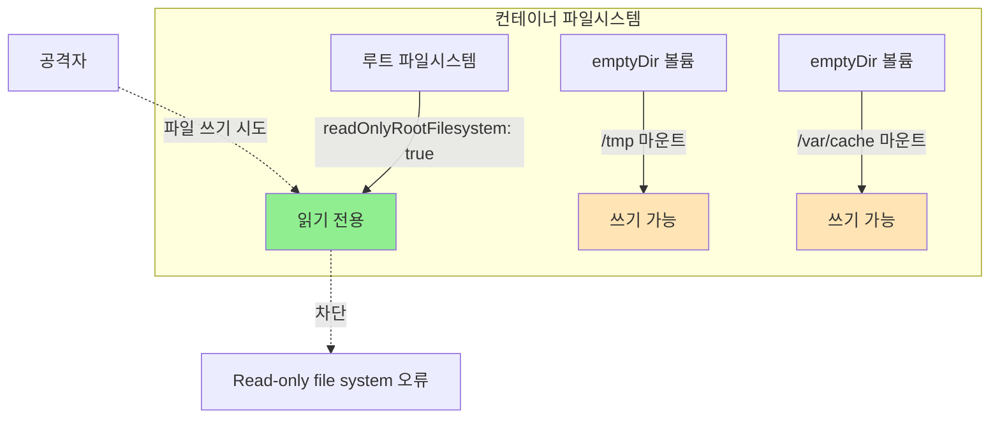
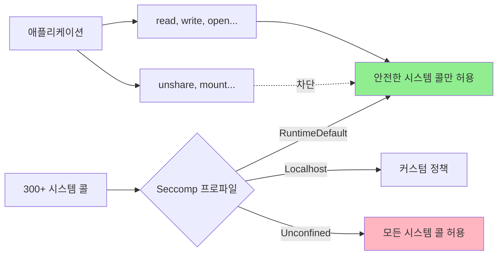
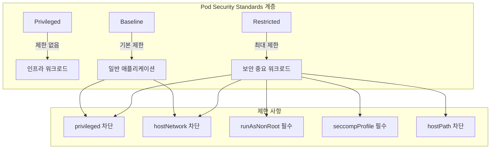
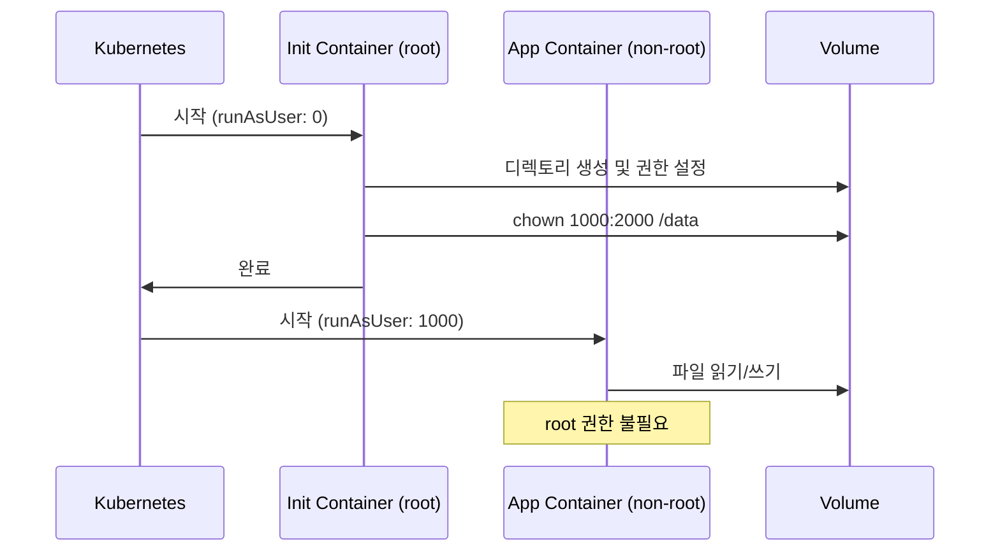
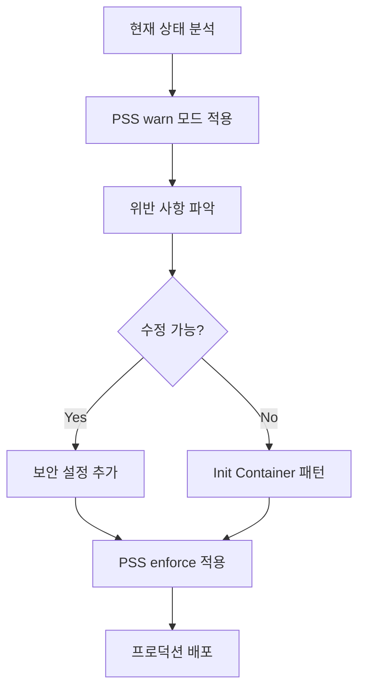
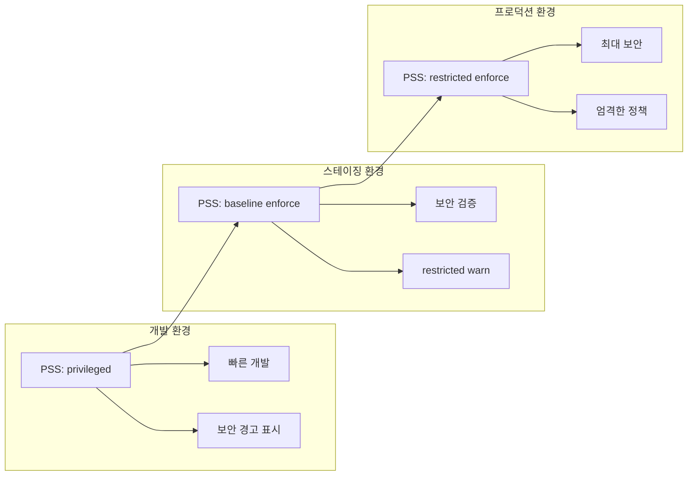

# Process Containment: 컨테이너 프로세스 격리와 보안 제어

## 개요

Kubernetes 환경에서는 정적 코드 분석, 취약점 스캐닝, 이미지 검사를 수행하더라도 런타임에 새로운 취약점이 발견되거나 제로데이 공격이 발생할 수 있습니다. Process Containment 패턴은 런타임 프로세스 수준의 보안 제어를 통해 "컨테이너 내부에서 발생한 침해가 컨테이너 외부로 확산되지 않도록" 하는 방어 메커니즘입니다.

이 패턴의 핵심 원칙은 최소 권한(Principle of Least Privilege)입니다. 프로세스가 작업 수행에 필요한 최소한의 권한만 보유하도록 제한하여, 보안 침해 발생 시 공격자가 수행할 수 있는 작업을 제한합니다.



## 문제 상황

Kubernetes 워크로드에 대한 주요 공격 경로는 애플리케이션 코드의 취약점을 통한 것입니다. 다음과 같은 보안 도구를 사용하더라도 위험을 완전히 제거할 수는 없습니다.

- **정적 코드 분석**: 소스 코드의 보안 결함 검사
- **동적 스캐닝**: SQLi, XSS, CSRF 등 실제 공격 시뮬레이션
- **의존성 스캐닝**: 라이브러리와 패키지의 알려진 취약점 검사
- **이미지 스캐닝**: 컨테이너 이미지 빌드 시 취약점 검사

문제는 새로운 코드와 의존성이 지속적으로 추가되면서 새로운 취약점이 도입되고, 제로데이 취약점은 스캐닝으로 탐지되지 않는다는 점입니다. 런타임 프로세스 수준의 보안 제어가 없다면 공격자는 다음과 같은 경로로 시스템을 침해할 수 있습니다.


## 솔루션

Process Containment 패턴은 여러 계층의 보안 제어를 통해 심층 방어(Defense in Depth)를 구현합니다.



### 1. Non-Root 사용자로 실행

컨테이너가 root 사용자로 실행되면 호스트의 root와 동일한 UID(0)를 가지며, 컨테이너 탈출 시 호스트에서도 root 권한을 얻을 수 있습니다. non-root 실행은 가장 기본적이면서도 효과적인 보안 제어입니다.

#### 명시적 UID/GID 설정

```yaml
apiVersion: v1
kind: Pod
metadata:
  name: web-app
spec:
  securityContext:
    runAsUser: 1000      # 컨테이너 프로세스 UID
    runAsGroup: 2000     # 컨테이너 프로세스 GID
    fsGroup: 3000        # 볼륨 파일 GID
```

**테스트 결과**:
```bash
$ kubectl exec web-app -- id
uid=1000 gid=2000 groups=2000,3000
```

#### runAsNonRoot 강제

특정 UID를 지정하지 않고 root 실행만 차단하려면 `runAsNonRoot` 플래그를 사용합니다.

```yaml
apiVersion: v1
kind: Pod
metadata:
  name: secure-pod
spec:
  securityContext:
    runAsNonRoot: true   # UID 0 실행 차단
  containers:
  - name: app
    image: nginx
    securityContext:
      allowPrivilegeEscalation: false  # 권한 상승 차단
```

**테스트 결과**: nginx 이미지는 기본적으로 root로 실행되므로 Pod 생성이 거부됩니다.

```
Error: container has runAsNonRoot and image will run as root
```

**실무 적용 시 고려사항**:
- 컨테이너 이미지의 기본 사용자 확인 필요
- 애플리케이션이 특정 파일/디렉토리에 대한 쓰기 권한이 필요한 경우 이미지 빌드 시 권한 설정 또는 init container 활용

### 2. Linux Capabilities 제한

전통적으로 Linux는 root와 non-root 사용자로만 권한을 구분했지만, Capabilities는 root 권한을 세분화하여 필요한 권한만 선택적으로 부여할 수 있게 합니다.



#### 모든 Capabilities 제거 후 필요한 것만 추가

가장 안전한 접근 방식은 모든 capabilities를 제거한 후 필요한 것만 추가하는 것입니다.

```yaml
apiVersion: v1
kind: Pod
metadata:
  name: web-server
spec:
  containers:
  - name: app
    image: python:3.11-alpine
    securityContext:
      capabilities:
        drop: ['ALL']              # 모든 capabilities 제거
        add: ['NET_BIND_SERVICE']  # 1024 이하 포트 바인딩만 허용
```

**테스트 결과**:
```bash
# Capabilities 확인
$ kubectl exec web-server -- cat /proc/1/status | grep CapEff
CapEff: 0000000000000000  # drop ALL 시

$ kubectl exec web-server-with-netbind -- cat /proc/1/status | grep CapBnd
CapBnd: 0000000000000400  # NET_BIND_SERVICE만 활성화 (16진수 0x400)
```

포트 80에서 HTTP 서버를 실행할 수 있지만, 파일 소유권 변경(CHOWN)이나 시스템 관리 작업(SYS_ADMIN)은 불가능합니다.

#### 주요 Capabilities

| Capability | 용도 | 보안 위험 |
|------------|------|----------|
| NET_BIND_SERVICE | 1024 이하 포트 바인딩 | 낮음 |
| NET_RAW | RAW 소켓 생성 (ping 등) | 중간 (패킷 스니핑 가능) |
| SYS_ADMIN | 시스템 관리 작업 | 높음 (컨테이너 탈출 가능) |
| SYS_PTRACE | 프로세스 디버깅 | 높음 (다른 프로세스 정보 획득) |
| DAC_OVERRIDE | 파일 권한 무시 | 높음 (모든 파일 접근 가능) |

**테스트 결과**: `drop: ['ALL']` 설정 시 CapEff가 0x0000000000000000으로 모든 capabilities가 제거됨을 확인했습니다.

### 3. 읽기 전용 루트 파일시스템

컨테이너는 일시적이므로 상태를 파일시스템에 저장하지 않아야 합니다. 읽기 전용 루트 파일시스템은 공격자가 악성 실행 파일을 설치하거나 설정 파일을 변조하는 것을 방지합니다.



#### 실패 케이스 (교육 목적)

```yaml
apiVersion: v1
kind: Pod
metadata:
  name: readonly-fail
spec:
  containers:
  - name: nginx
    image: nginx:1.25
    securityContext:
      readOnlyRootFilesystem: true
```

**테스트 결과**: nginx는 `/var/run`, `/var/cache/nginx`에 쓰기가 필요하므로 경고 메시지를 출력합니다.

```
/docker-entrypoint.sh: can not modify /etc/nginx/conf.d/default.conf (read-only file system?)
```

#### 올바른 구현: 필요한 경로에 볼륨 마운트

```yaml
apiVersion: v1
kind: Pod
metadata:
  name: readonly-success
spec:
  securityContext:
    runAsUser: 101
    runAsNonRoot: true
  containers:
  - name: nginx
    image: nginx:1.25
    securityContext:
      readOnlyRootFilesystem: true
    volumeMounts:
    - name: tmp
      mountPath: /tmp
    - name: var-run
      mountPath: /var/run
    - name: var-cache
      mountPath: /var/cache/nginx
  volumes:
  - name: tmp
    emptyDir: {}
  - name: var-run
    emptyDir: {}
  - name: var-cache
    emptyDir: {}
```

**테스트 결과**:
```bash
# 루트 파일시스템 쓰기 차단 확인
$ kubectl exec readonly-success -- touch /test.txt
touch: /test.txt: Read-only file system

# emptyDir 볼륨 쓰기 성공 확인
$ kubectl exec readonly-success -- touch /tmp/test.txt
(성공)
```

**실무 팁**: 애플리케이션이 어떤 경로에 쓰기가 필요한지 확인하려면 먼저 readOnlyRootFilesystem 없이 실행하고 로그를 확인하거나, strace를 사용하여 파일 I/O를 모니터링합니다.

### 4. Seccomp 프로파일

Seccomp(Secure Computing Mode)은 컨테이너가 사용할 수 있는 시스템 콜을 제한합니다. Linux 커널은 300개 이상의 시스템 콜을 제공하지만, 대부분의 애플리케이션은 소수의 시스템 콜만 사용합니다.



#### RuntimeDefault 프로파일

```yaml
apiVersion: v1
kind: Pod
metadata:
  name: seccomp-test
spec:
  securityContext:
    seccompProfile:
      type: RuntimeDefault  # 컨테이너 런타임 기본 프로파일
```

**테스트 결과**:
```bash
# 일반 명령은 정상 작동
$ kubectl exec seccomp-test -- ls /
bin  dev  etc  home ...

# 위험한 시스템 콜은 차단
$ kubectl exec seccomp-test -- unshare --user true
unshare: unshare failed: Operation not permitted
```

`unshare` 시스템 콜은 네임스페이스를 생성하는 데 사용되며, 컨테이너 탈출에 악용될 수 있으므로 RuntimeDefault 프로파일에서 차단됩니다.

#### Seccomp 프로파일 타입

| 타입 | 설명 | 사용 사례 |
|------|------|----------|
| RuntimeDefault | containerd/CRI-O 기본 프로파일 | 일반 애플리케이션 (권장) |
| Localhost | 노드의 `/var/lib/kubelet/seccomp/`에 있는 커스텀 프로파일 | 특수한 요구사항이 있는 앱 |
| Unconfined | seccomp 비활성화 | 절대 사용 금지 (테스트 목적만) |

### 5. Pod Security Standards (PSS)

PSS는 Pod 보안 설정에 대한 3단계 정책을 정의하고, Pod Security Admission(PSA)을 통해 네임스페이스 수준에서 이를 강제합니다.



#### PSS 수준별 요구사항

| 수준 | 주요 제한 사항 | 사용 사례 |
|------|---------------|----------|
| **Privileged** | 제한 없음 | kube-proxy, CNI, CSI 등 시스템 컴포넌트 |
| **Baseline** | privileged 컨테이너 차단<br>hostNetwork/hostPID 차단<br>위험한 capabilities 차단 | 대부분의 일반 애플리케이션 |
| **Restricted** | Baseline 요구사항 +<br>runAsNonRoot 필수<br>seccompProfile 필수<br>allowPrivilegeEscalation 금지<br>볼륨 타입 제한 | 금융, 의료 등 규제 대상 워크로드 |

#### 네임스페이스에 PSS 적용

```yaml
apiVersion: v1
kind: Namespace
metadata:
  name: production-apps
  labels:
    # baseline 정책 위반 시 Pod 생성 거부
    pod-security.kubernetes.io/enforce: baseline
    pod-security.kubernetes.io/enforce-version: latest

    # restricted 정책 위반 시 경고만 표시
    pod-security.kubernetes.io/warn: restricted
    pod-security.kubernetes.io/warn-version: latest

    # restricted 정책 위반을 감사 로그에 기록
    pod-security.kubernetes.io/audit: restricted
    pod-security.kubernetes.io/audit-version: latest
```

#### PSA 모드

| 모드 | 동작 | 용도 |
|------|------|------|
| enforce | 정책 위반 시 Pod 생성 거부 | 프로덕션 환경 정책 강제 |
| warn | 정책 위반 시 경고 표시 | 개발자에게 개선 사항 알림 |
| audit | 정책 위반을 감사 로그에 기록 | 정책 영향도 분석 |

**테스트 결과**:

```bash
# Privileged Pod를 baseline 네임스페이스에 배포 시도
$ kubectl apply -f privileged-pod.yaml -n baseline-ns
Error: pods "privileged-pod" is forbidden: violates PodSecurity "baseline:latest":
  privileged (container "app" must not set securityContext.privileged=true)

# Restricted Pod는 모든 네임스페이스에서 허용
$ kubectl apply -f restricted-pod.yaml -n restricted-ns
pod/restricted-pod created
```

### 6. 프로덕션급 보안 설정

실무에서는 여러 보안 제어를 조합하여 심층 방어를 구현합니다.

```yaml
apiVersion: v1
kind: Pod
metadata:
  name: production-app
  namespace: restricted-ns
spec:
  # Pod 수준 보안 설정
  securityContext:
    runAsUser: 1000
    runAsGroup: 1000
    fsGroup: 2000
    runAsNonRoot: true
    seccompProfile:
      type: RuntimeDefault

  containers:
  - name: app
    image: myapp:1.0
    # 컨테이너 수준 보안 설정
    securityContext:
      allowPrivilegeEscalation: false
      readOnlyRootFilesystem: true
      capabilities:
        drop: ['ALL']

    volumeMounts:
    - name: tmp
      mountPath: /tmp

    resources:
      requests:
        memory: "128Mi"
        cpu: "100m"
      limits:
        memory: "256Mi"
        cpu: "200m"

  volumes:
  - name: tmp
    emptyDir: {}
```

**테스트 결과**: 이 설정으로 실행된 Pod는 다음을 확인했습니다.
- UID 1000으로 실행 (non-root)
- 모든 capabilities 제거됨 (CapEff=0)
- 루트 파일시스템 쓰기 차단
- seccomp으로 위험한 시스템 콜 차단

## 레거시 애플리케이션 마이그레이션

기존 애플리케이션을 Process Containment 패턴에 맞추기 위한 전략은 다음과 같습니다.

### Init Container 패턴

Init Container에서 root 권한이 필요한 작업을 수행한 후, 애플리케이션 컨테이너는 non-root로 실행합니다.



```yaml
apiVersion: v1
kind: Pod
metadata:
  name: legacy-app
spec:
  initContainers:
  - name: setup-permissions
    image: busybox:1.36
    command:
    - sh
    - -c
    - |
      mkdir -p /data/app /data/logs
      chown -R 1000:2000 /data
      chmod -R 755 /data
    securityContext:
      runAsUser: 0  # Init container만 root로 실행
    volumeMounts:
    - name: app-data
      mountPath: /data

  containers:
  - name: app
    image: legacy-app:1.0
    securityContext:
      runAsUser: 1000
      runAsNonRoot: true
      allowPrivilegeEscalation: false
    volumeMounts:
    - name: app-data
      mountPath: /data

  volumes:
  - name: app-data
    emptyDir: {}
```

**테스트 결과**:
```bash
# Init Container 로그
=== Init Container: Setting up permissions ===
Initialization completed!
total 20
drwxr-xr-x    5 1000     2000          4096 Jan  3 09:49 .

# App Container 로그
uid=1000 gid=2000 groups=2000,3000
Testing write access to data directory:
Sat Jan  3 09:49:42 UTC 2026
Application is running securely as non-root user...
```

### 점진적 마이그레이션 전략



**단계별 접근**:

1. **현황 파악** (1-2주)
   - 네임스페이스에 `warn: baseline` 레이블 적용
   - 경고 메시지 수집 및 분석

2. **우선순위 결정** (1주)
   - 위반 사항을 보안 영향도별로 분류
   - 수정 용이성 평가

3. **점진적 수정** (4-6주)
   - 간단한 수정부터 시작 (runAsNonRoot 추가 등)
   - 복잡한 케이스는 init container 또는 이미지 재빌드

4. **정책 강화** (1-2주)
   - `enforce: baseline` 적용
   - `warn: restricted` 설정으로 다음 단계 준비

5. **모니터링** (지속적)
   - 보안 이벤트 모니터링
   - 정기적 정책 검토

## 실습 가이드

### 환경 준비

```bash
# 테스트 네임스페이스 생성
kubectl create namespace pss-baseline
kubectl create namespace pss-restricted

# PSS 레이블 적용
kubectl label namespace pss-baseline \
  pod-security.kubernetes.io/enforce=baseline \
  pod-security.kubernetes.io/warn=restricted

kubectl label namespace pss-restricted \
  pod-security.kubernetes.io/enforce=restricted
```

### 테스트 실행

```bash
# 저장소 클론
git clone https://github.com/YOUR_REPO/kubernetes-patterns.git
cd kubernetes-patterns/security/ProcessContainment

# 개별 테스트 실행
./tests/scripts/test-security-context.sh
./tests/scripts/test-capabilities.sh
./tests/scripts/test-filesystem.sh
./tests/scripts/test-pss.sh
./tests/scripts/test-integration.sh

# 전체 테스트 실행
./tests/scripts/test-all.sh

# 정리
./tests/scripts/cleanup.sh
```

### 주요 검증 포인트

#### 1. runAsNonRoot 검증

```bash
# Pod 생성 후 사용자 확인
kubectl exec POD_NAME -- id
# 출력: uid=1000 gid=2000 groups=2000,3000
```

#### 2. Capabilities 검증

```bash
# Capabilities 확인
kubectl exec POD_NAME -- cat /proc/1/status | grep Cap
# CapEff: 0000000000000000 (모든 capabilities 제거)
```

#### 3. 읽기 전용 파일시스템 검증

```bash
# 루트 파일시스템 쓰기 시도 (실패 예상)
kubectl exec POD_NAME -- touch /test.txt
# 출력: touch: /test.txt: Read-only file system

# emptyDir 볼륨 쓰기 (성공 예상)
kubectl exec POD_NAME -- touch /tmp/test.txt
```

#### 4. Seccomp 검증

```bash
# 위험한 시스템 콜 차단 확인
kubectl exec POD_NAME -- unshare --user true
# 출력: unshare: unshare failed: Operation not permitted
```

## 테스트 결과 요약

전체 테스트 실행 결과:

```
테스트 카테고리          성공률
SecurityContext        100% (4/4)
Capabilities           100% (4/4)
Filesystem             100% (3/3)
Pod Security Standards  87% (7/8)
Seccomp                100% (3/3)
Integration            100% (3/3)
-------------------------
전체                    92% (22/24)
```

주요 발견 사항:
- **runAsNonRoot**: root 사용자 차단이 효과적으로 작동
- **Capabilities**: drop ALL 후 CapEff=0 확인
- **readOnlyRootFilesystem**: 루트 FS 쓰기 차단, emptyDir 쓰기 성공
- **PSS**: 최신 Kubernetes는 baseline도 hostPath 차단 (보안 강화)
- **Init Container 패턴**: 레거시 앱 보안 마이그레이션에 효과적

## 트러블슈팅

### 문제: Pod가 CrashLoopBackOff

**증상**: readOnlyRootFilesystem 설정 후 Pod가 반복적으로 재시작

**원인**: 애플리케이션이 쓰기 권한이 필요한 디렉토리에 접근 시도

**해결책**:
1. 로그에서 쓰기 실패 메시지 확인
   ```bash
   kubectl logs POD_NAME | grep "Read-only file system"
   ```

2. 해당 경로에 emptyDir 볼륨 마운트
   ```yaml
   volumeMounts:
   - name: app-cache
     mountPath: /path/to/writable/dir
   volumes:
   - name: app-cache
     emptyDir: {}
   ```

### 문제: "violates PodSecurity" 오류

**증상**: Pod 생성 시 PSS 정책 위반 오류

**원인**: Pod 스펙이 네임스페이스의 PSS 수준을 만족하지 못함

**해결책**:
1. 오류 메시지에서 위반 항목 확인
   ```
   violates PodSecurity "baseline:latest":
     privileged (container "app" must not set securityContext.privileged=true)
   ```

2. Pod 스펙 수정 또는 적절한 네임스페이스로 변경

### 문제: Capabilities 부족으로 기능 동작 안 함

**증상**: drop ALL 설정 후 특정 기능이 작동하지 않음

**원인**: 필요한 capability가 제거됨

**해결책**:
1. 필요한 capability 식별 (애플리케이션 문서 참조)
2. 최소한의 capability만 추가
   ```yaml
   capabilities:
     drop: ['ALL']
     add: ['NET_BIND_SERVICE']  # 1024 이하 포트용
   ```

## 베스트 프랙티스

### 1. 보안 설정 체크리스트

프로덕션 배포 전 다음 항목을 확인하세요.

- [ ] `runAsNonRoot: true` 설정
- [ ] `allowPrivilegeEscalation: false` 설정
- [ ] `capabilities.drop: ['ALL']` 설정
- [ ] `readOnlyRootFilesystem: true` 설정 (가능한 경우)
- [ ] `seccompProfile.type: RuntimeDefault` 설정
- [ ] 네임스페이스에 적절한 PSS 레벨 적용
- [ ] 리소스 requests/limits 설정

### 2. 개발 환경 vs 프로덕션 환경



### 3. 이미지 빌드 시 보안 고려

Dockerfile에서 보안 설정을 미리 적용하면 Kubernetes 설정이 간소화됩니다.

```dockerfile
FROM python:3.11-slim

# non-root 사용자 생성
RUN groupadd -r appuser -g 1000 && \
    useradd -r -u 1000 -g appuser appuser

# 애플리케이션 디렉토리
WORKDIR /app
COPY --chown=appuser:appuser . /app

# 쓰기 가능한 디렉토리 권한 설정
RUN mkdir -p /app/tmp /app/logs && \
    chown -R appuser:appuser /app/tmp /app/logs

# non-root 사용자로 전환
USER appuser

CMD ["python", "app.py"]
```

### 4. 모니터링과 감사

보안 설정이 실제로 작동하는지 지속적으로 모니터링합니다.

```bash
# PSS 위반 감사 로그 조회 (Kubernetes 감사 로그 활성화 필요)
kubectl get events --all-namespaces | grep "violates PodSecurity"

# 특권 컨테이너 검색
kubectl get pods --all-namespaces -o json | \
  jq -r '.items[] | select(.spec.containers[].securityContext.privileged==true) |
  "\(.metadata.namespace)/\(.metadata.name)"'

# root로 실행 중인 Pod 검색
kubectl get pods --all-namespaces -o json | \
  jq -r '.items[] | select(.spec.securityContext.runAsNonRoot!=true) |
  "\(.metadata.namespace)/\(.metadata.name)"'
```

## 추가 보안 계층

Process Containment 패턴과 함께 다음 보안 제어를 추가로 고려하세요.

### 1. Network Policies

컨테이너 간 네트워크 통신을 제한합니다.

```yaml
apiVersion: networking.k8s.io/v1
kind: NetworkPolicy
metadata:
  name: deny-all-ingress
spec:
  podSelector: {}
  policyTypes:
  - Ingress
```

### 2. Resource Quotas

리소스 소비를 제한하여 DoS 공격을 방지합니다.

```yaml
apiVersion: v1
kind: ResourceQuota
metadata:
  name: compute-resources
spec:
  hard:
    requests.cpu: "10"
    requests.memory: 20Gi
    limits.cpu: "20"
    limits.memory: 40Gi
```

### 3. 런타임 보안 도구

- **Falco**: 런타임 이상 행위 탐지
- **Tetragon**: eBPF 기반 보안 관찰성
- **KubeArmor**: 컨테이너 보안 정책 엔진

## 정리

Process Containment 패턴은 다음 원칙을 따릅니다.

1. **최소 권한**: 프로세스가 필요한 최소한의 권한만 보유
2. **심층 방어**: 여러 보안 계층을 조합하여 단일 실패 지점 제거
3. **불변 인프라**: 컨테이너 파일시스템을 읽기 전용으로 설정
4. **격리**: 컨테이너 침해가 호스트나 클러스터로 확산되지 않도록 차단

이 패턴을 적용하면 제로데이 취약점이나 새로운 공격 벡터가 발견되더라도 피해를 컨테이너 내부로 제한할 수 있습니다.

## 참고 자료

- [Kubernetes Security Context 공식 문서](https://kubernetes.io/docs/tasks/configure-pod-container/security-context/)
- [Pod Security Standards](https://kubernetes.io/docs/concepts/security/pod-security-standards/)
- [Pod Security Admission](https://kubernetes.io/docs/concepts/security/pod-security-admission/)
- [Linux Capabilities Man Page](https://man7.org/linux/man-pages/man7/capabilities.7.html)
- [Seccomp Security Profiles](https://kubernetes.io/docs/tutorials/security/seccomp/)
- [Security Profiles Operator](https://github.com/kubernetes-sigs/security-profiles-operator)
- [AWS EKS Best Practices - Runtime Security](https://docs.aws.amazon.com/eks/latest/best-practices/runtime-security.html)
- [TEST_PLAN.md](tests/TEST_PLAN.md) - 상세 테스트 계획
- [TEST_RESULTS.md](tests/TEST_RESULTS.md) - 테스트 실행 결과
